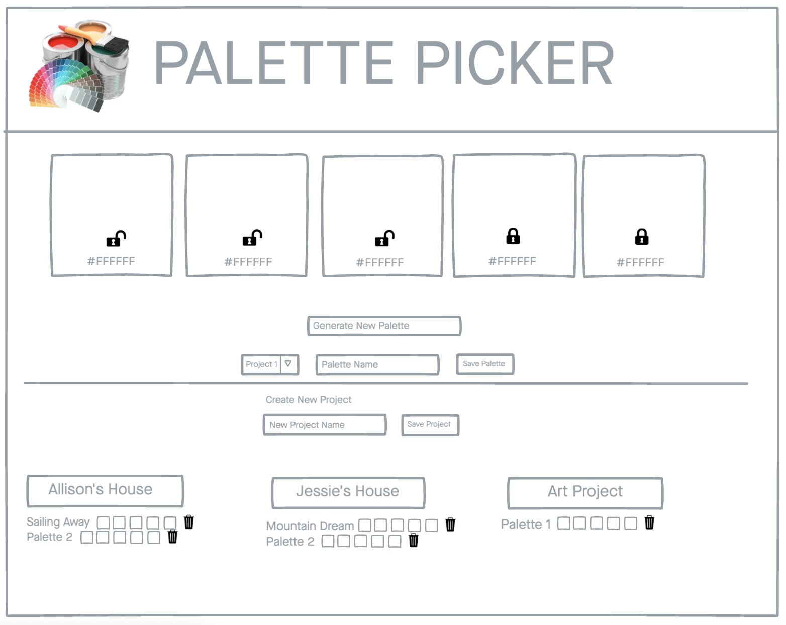

## Palette Picker FE (Front End)

Palette Picker is a color generator to assist in coming up with the right color palette for whatever you're working on. Users can generate a color palette, save it for future projects, edit/update saved projects and color palettes, and delete projects and palettes. So let you crafty side come out and find your perfect color palette!

#### Live Application - [Heroku]()

## Collaborators 
- [Allison Wagner](https://github.com/allisonjw) 
- [Jessie ](https://github.com/Jessiewithani)

### [Sprint Project Board](https://github.com/allisonjw/palette-picker-FE/projects/1)

---

### [Back End Repo](https://github.com/allisonjw/palette-picker-BE)

---

### Tech Used

- React
- Enzyme/Jest
- PostgreSQL
- JavaScript / Node.js

---

## WireFrame

<details>
<summary>Initial Wireframe design</summary>

</details>

---

### Clone down the API

1. Clone down the repo [Palette Picker Front-end](https://github.com/KVeitch/palette-picker-front-end.git)
2. Switch to the cloned directory
3. In your terminal run  
                          ```npm install```
4. Then run   
              ```npm start```

--- 

### Screenshots


